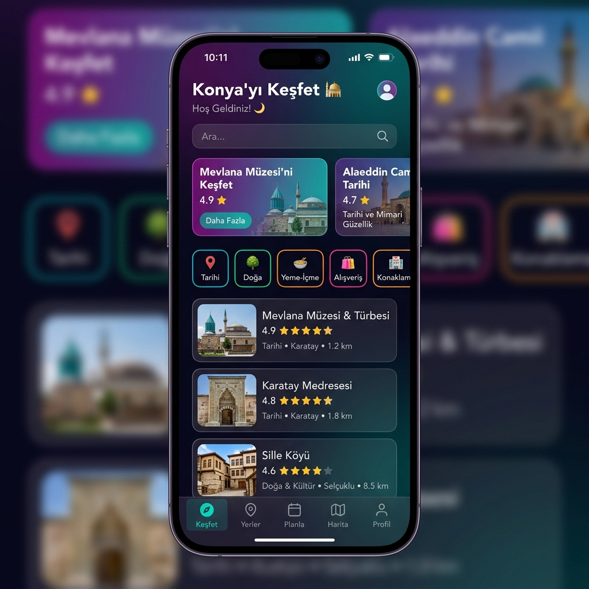
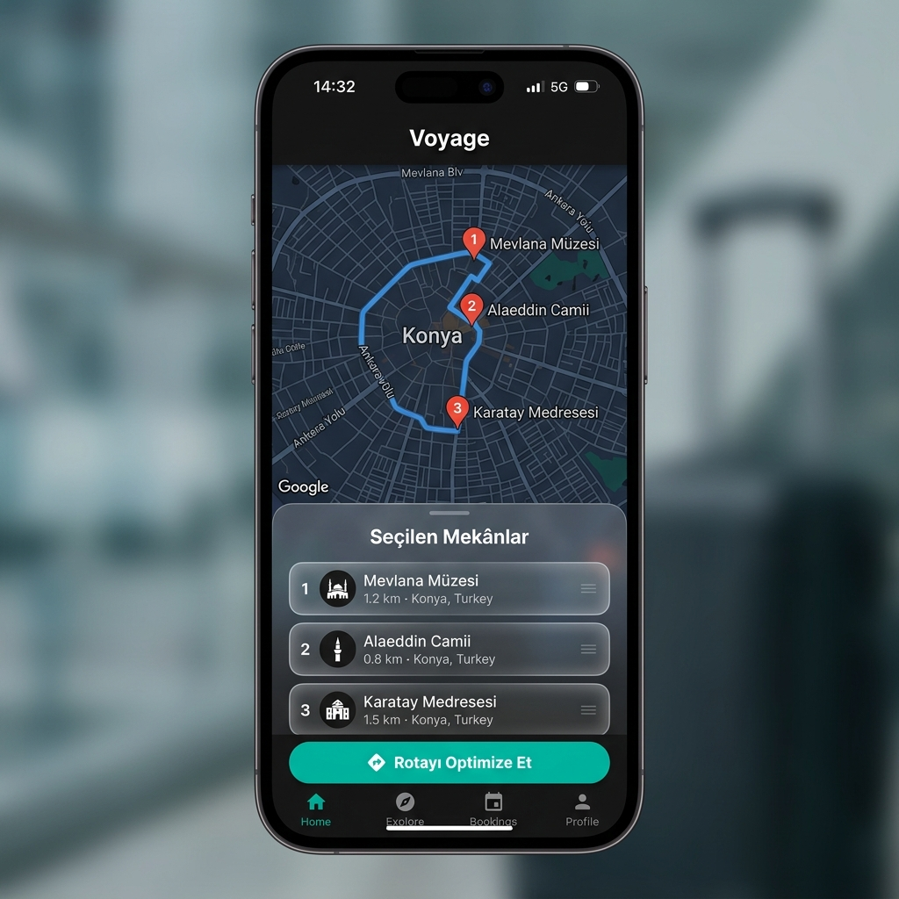
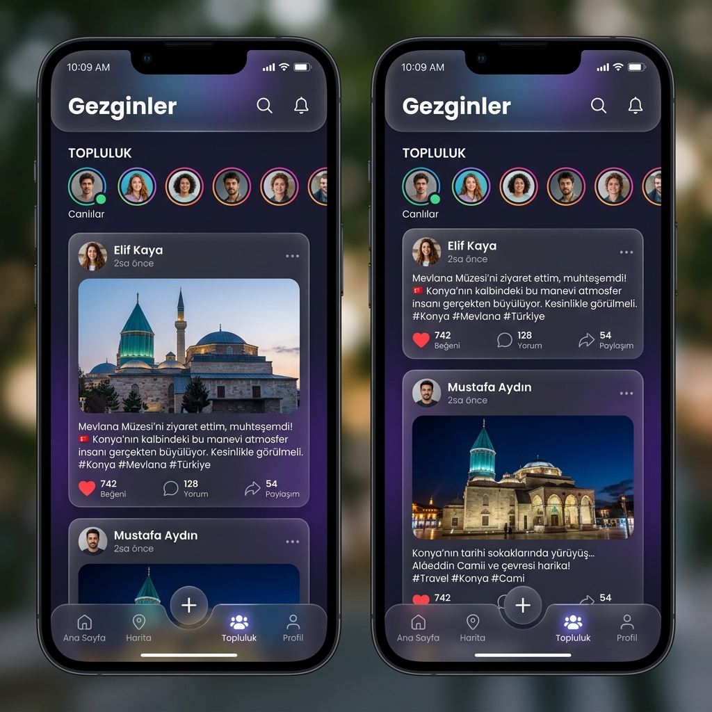

# Akıllı Seyahat Asistanı

Konya Teknik Üniversitesi Bilgisayar Mühendisliği bölümü 3. sınıf dönem projesi olarak geliştirilen bu uygulama, Konya'daki tarihi ve kültürel mekânları keşfetmeni, kendi gezi rotanı oluşturmanı ve rotanı optimize etmeni sağlayan bir mobil seyahat asistanıdır.

<p align="center">
  
  &nbsp;
  
  &nbsp;
  
</p>

<p align="center">
  <sub>⚠️ Görseller temsilidir, uygulamanın gerçek ekran görüntüleri değildir.</sub>
</p>

---

## Özellikler

- 🔍 Kategori, puan ve bütçeye göre mekân arama ve filtreleme
- 🗺️ Google Maps üzerinde mekân görüntüleme
- 🤖 **Rota optimizasyonu** — Nearest Neighbor + 2-Opt algoritmasıyla en verimli ziyaret sırası
- 📍 Haversine formülüyle mesafe hesaplama
- ❤️ Favori mekânlar ve kişisel rota kaydetme
- 👥 Oluşturulan rotaları toplulukta paylaşma
- 💬 Paylaşılan rotalara yorum yapma ve beğeni sistemi
- 📸 Firebase Storage ile fotoğraf yükleme
- 🔐 Firebase Authentication ile kullanıcı girişi ve kayıt

---

## Kullanılan Teknolojiler

| Alan | Teknoloji |
|---|---|
| Mobil Uygulama | Flutter / Dart |
| Veritabanı | Firebase Cloud Firestore |
| Kimlik Doğrulama | Firebase Authentication |
| Dosya Depolama | Firebase Storage |
| Harita | Google Maps Flutter |
| Mekân Verisi | Google Places API |
| Hava Durumu | Open-Meteo API |
| Görsel Önbellek | CachedNetworkImage |

---

## Kurulum

```bash
git clone https://github.com/gulsenacy/akilli-seyahat-asistani.git
cd akilli-seyahat-asistani
flutter pub get
flutter run
```

> **Not:** Projeyi çalıştırmak için kendi Firebase projenizi ve Google Maps API anahtarınızı oluşturmanız gerekir. `google-services.json` dosyası güvenlik nedeniyle `.gitignore`'a eklenmiştir.

---

## Geliştirici

**Gülsena Özongun** — Konya Teknik Üniversitesi, Bilgisayar Mühendisliği  
GitHub: [@gulsenacy](https://github.com/gulsenacy)
